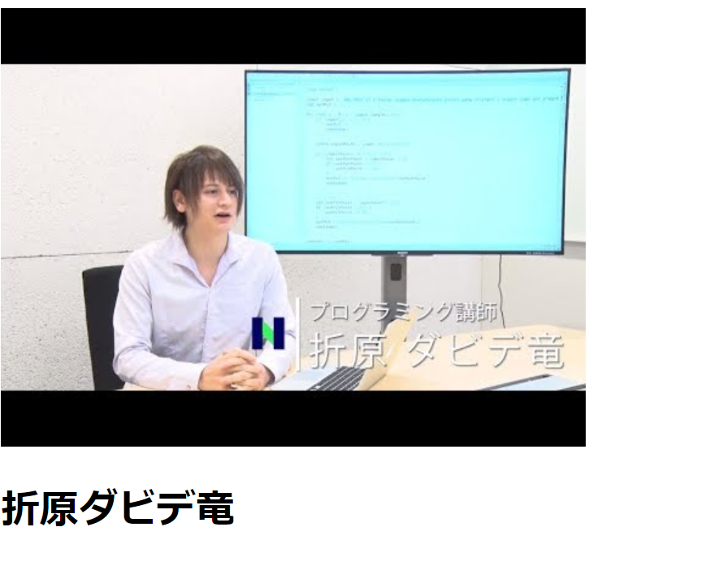

# About
プログラミングを教えるために日本にやってきました。

# profile
- 折原ダビデ竜（D_drAAgon）
- 東京都
- パスタ食べろ！

<a class="twitter-timeline" data-width="400" data-height="600" href="https://twitter.com/D_drAAgon?ref_src=twsrc%5Etfw">Tweets by D_drAAgon</a> 

## Skills
- お手玉、メンコ
- 刺客

## Works
- [動く Web ページコンテスト2019冬](https://progedu.github.io/web-contests/webcontest2019-winter/)

<iframe src="https://www.openprocessing.org/sketch/823308/embed/" width="400" height="300"></iframe>

## Contact
- [Twitter](https://twitter.com/D_drAAgon)

# History
- 2020年ドワンゴ幼稚園に入園

<noscript><a href="https://www.nicovideo.jp/watch/1500362884">N予備校夏期講習2017CM</a></noscript>
